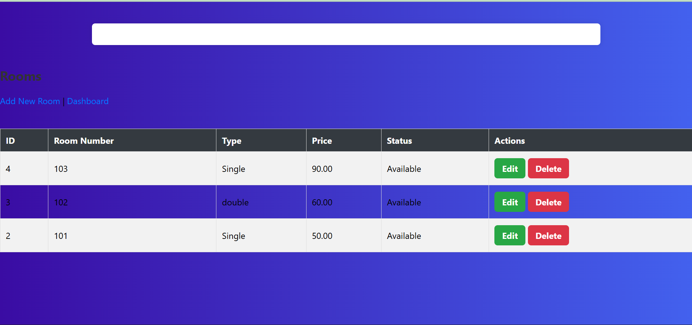
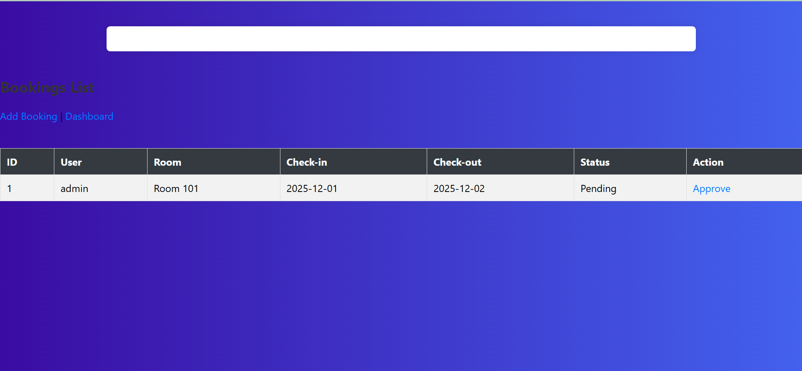

# Hotel Reservation System

## Group Members
- Hirwa Christian – 24RP00849
- IRADUKUNDA Eric - 24RP03808 

## Project Title
Hotel Reservation System

## Short Description
A mini web application to manage hotel rooms and bookings using PHP and MySQL. Includes login/logout, CRUD for rooms and bookings, and a responsive dashboard.

## Features
- Secure login/logout  
- Add, view, edit, delete rooms  
- Add, view, approve, delete bookings  
- Responsive dashboard  
- Form validation and error handling  

## Instructions to Run
1. Install XAMPP and start Apache & MySQL  
2. Copy the project folder to `C:\xampp\htdocs\`  
3. Import `hotel_reservation.sql` into MySQL using phpMyAdmin  
4. Open browser: `http://localhost/hotel_reservation/auth/login.php`  
5. Use sample credentials to login  

## Screenshots
  
  
  

